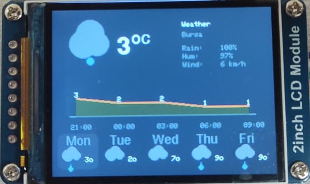
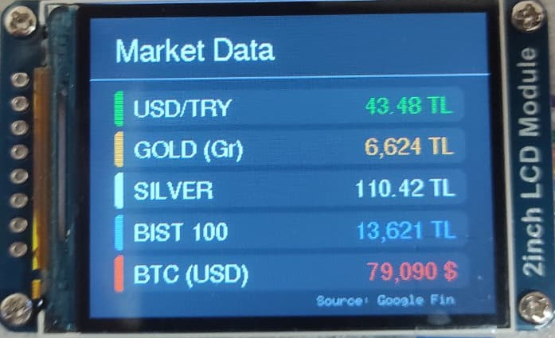

# ESP8266 Finance & Weather Monitor (Wemos D1 Mini + ST7789)

Bu proje, ESP8266 (Wemos D1 Mini) ve ST7789 IPS ekran kullanarak oluşturulmuş kompakt bir masaüstü bilgi ekranıdır. Tek bir buton ile **Detaylı Hava Durumu** ve **Canlı Finans Verileri** arasında geçiş yapabilirsiniz.

This project is a compact desktop dashboard built with ESP8266 (Wemos D1 Mini) and ST7789 IPS display. You can switch between **Detailed Weather Forecast** and **Live Financial Data** with a single button press.

---

## 🇹🇷 TÜRKÇE (Turkish)

### 🌟 Özellikler
* **Hava Durumu:** OpenWeatherMap API kullanılarak 5 günlük detaylı tahmin, sıcaklık, nem, rüzgar hızı ve yağış ihtimali.
* **Finans:** Google Apps Script altyapısı ile anlık Dolar (USD/TRY), Altın (Gram), Gümüş, BIST 100 ve Bitcoin verileri.
* **Görsel:** Renkli grafikler, özel ikonlar ve yuvarlatılmış kart tasarımı.
* **Donanım:** Fiziksel buton ile ekranlar arası geçiş ve uyku modu desteği.

### 🛠️ Gerekli Malzemeler
* Wemos D1 Mini (veya NodeMCU ESP8266)
* 1.3" veya 1.54" ST7789 TFT Ekran (240x240)
* Push Button (Bas-Çek Buton)
* Jumper Kablolar ve Breadboard (veya lehimleme seti)

### 🔌 Devre Bağlantısı (Pinout)

| ST7789 Pin | Wemos D1 Mini (ESP8266) | Açıklama |
| :--- | :--- | :--- |
| **VCC** | 3.3V | Güç |
| **GND** | GND | Toprak |
| **CLK** | D5 (GPIO14) | SPI Clock |
| **DIN** | D7 (GPIO13) | SPI Data (MOSI) |
| **RST** | D2 (GPIO4) | Reset |
| **DC** | D1 (GPIO5) | Data/Command |
| **CS** | D8 (GPIO15) | Chip Select |
| **BL** | 3.3V | Arka Işık |
| **Button** | D3 (GPIO0) | Butonun diğer ucu GND'ye |

### 🚀 Kurulum

1.  **Kütüphaneleri Yükleyin:** Arduino IDE Kütüphane Yöneticisinden şunları kurun:
    * `Adafruit GFX Library`
    * `Adafruit ST7789 Library`
    * `ArduinoJson` (Sürüm 6.x veya üzeri)
2.  **Google Script Kurulumu:**
    * `google_script/Code.gs` dosyasındaki kodu kopyalayın.
    * [script.google.com](https://script.google.com/) adresine gidip yeni proje oluşturun ve kodu yapıştırın.
    * `Yayınla` > `Web Uygulaması Olarak Dağıt` seçeneğini seçin.
    * **Erişimi:** "Anyone (Herkes)" olarak ayarlayın ve dağıtın.
    * Size verilen URL'i kopyalayın.
3.  **Ayarları Yapılandırın:**
    * Dosyanın içine WiFi bilgilerinizi, OpenWeatherMap API anahtarınızı ve Google Script URL'inizi girin.
4.  **Yükleme:** Kodu ESP8266 kartınıza yükleyin.

---

## 🇬🇧 ENGLISH

### 🌟 Features
* **Weather:** 5-day forecast, temperature, humidity, wind speed, and rain probability using OpenWeatherMap API.
* **Finance:** Live tracking of USD, Gold, Silver, Local Stock Market (BIST), and Bitcoin using a custom Google Apps Script backend.
* **Visuals:** Color-coded graphs, custom weather icons, and modern UI with rounded cards.
* **Hardware:** Toggle between screens using a physical button.

### 🛠️ Bill of Materials (BOM)
* Wemos D1 Mini (or generic ESP8266 NodeMCU)
* 1.3" or 1.54" ST7789 TFT Display (240x240)
* Push Button
* Jumper Wires & Breadboard

### 🔌 Wiring Diagram

| ST7789 Pin | Wemos D1 Mini (ESP8266) | Description |
| :--- | :--- | :--- |
| **VCC** | 3.3V | Power |
| **GND** | GND | Ground |
| **CLK** | D5 (GPIO14) | SPI Clock |
| **DIN** | D7 (GPIO13) | SPI Data (MOSI) |
| **RST** | D2 (GPIO4) | Reset |
| **DC** | D1 (GPIO5) | Data/Command |
| **CS** | D8 (GPIO15) | Chip Select |
| **BL** | 3.3V | Backlight |
| **Button** | D3 (GPIO0) | Other leg to GND |

### 🚀 Installation Guide

1.  **Install Libraries:** Use the Arduino Library Manager to install:
    * `Adafruit GFX Library`
    * `Adafruit ST7789 Library`
    * `ArduinoJson` (Version 6.x or higher)
2.  **Google Script Setup:**
    * Copy the code from `google_script/Code.gs`.
    * Go to [script.google.com](https://script.google.com/), create a new project, and paste the code.
    * Click `Deploy` > `New Deployment` > `Select type: Web app`.
    * **Who has access:** Set to "Anyone" (important!).
    * Copy the generated Deployment URL.
3.  **Configuration:**
    * Fill in your WiFi credentials, OpenWeatherMap API Key, and the Google Script URL.
4.  **Flash:** Upload the code to your ESP8266.

---

### 📷 Gallery

| Weather Screen | Finance Screen |
| :---: | :---: |
|  |  |
*(Resimler temsilidir / Images are representative)*

---

### 📄 License

This project is licensed under the MIT License - see the [LICENSE](LICENSE) file for details.
